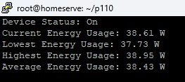

<h1>Smart Plug Energy Monitoring Tool</h1>

This Python script enables real-time monitoring of energy usage through a TP-Link Smart Plug (model P110). Utilizing the <code>PyP100</code> library, it communicates with the smart plug to fetch and display device status, current power draw, daily energy consumption, and session-based energy statistics. The script features a dynamic, interactive terminal interface built with Python's <code>curses</code> module.

<h2>Features</h2>
<ul>
  <li><strong>Device Status Display</strong>: Shows whether the smart plug is currently ON or OFF.</li>
  <li><strong>Real-time Power Monitoring</strong>: Displays the current energy consumption in watts.</li>
  <li><strong>Today's Total Energy Usage</strong>: Displays the total energy consumed on the current day in kilowatt-hours (kWh).</li>
  <li><strong>Session Energy Statistics</strong>: Calculates and displays statistics including the minimum, maximum, and average power usage recorded during the current session.</li>
  <li><strong>Interactive Curses Interface</strong>:
    <ul>
      <li>Real-time updates of all metrics in a structured and clear layout.</li>
      <li>Dedicated lines for device status, current power, today's total energy, session statistics, action feedback, and error messages.</li>
      <li>Interactive commands: Press 'Enter' to toggle the plug state, 'Q' to quit.</li>
      <li>Improved visual feedback for ongoing actions (e.g., "Device turning On...") and error conditions, including device communication issues.</li>
    </ul>
  </li>
  <li><strong>Environment Variable Configuration</strong>: Securely configure your device IP and Tapo credentials using environment variables.</li>
  <li><strong>Robust Error Handling</strong>: Gracefully handles and displays common communication errors and data format issues.</li>
</ul>

<h2>How It Works</h2>

The script initializes a connection to the TP-Link P110 smart plug using its IP address and your Tapo account credentials (set via environment variables). After a successful handshake and login, it enters a main loop that runs within a <code>curses</code> terminal window. In this loop, it periodically fetches and updates the device's status, current power usage, today's total energy consumption, and calculates session-based energy statistics. These details are dynamically displayed in the terminal. Users can interact with the plug by pressing 'Enter' to toggle its power state or 'Q' to quit the application. The script is designed to handle potential communication errors and display them to the user without crashing.

<h2>Setup and Configuration</h2>
<ol>
  <li><strong>Dependencies</strong>: Ensure you have Python 3.x installed along with the <code>PyP100</code> library and <code>curses</code> (pre-installed with Python on Linux/MacOS; for Windows, you might need <code>windows-curses</code>: <code>pip install windows-curses</code>). See the "Installation Troubleshooting" section below for help with <code>PyP100</code> library installation if you encounter issues.</li>
  <li><strong>Smart Plug Setup</strong>: Assign a static IP address to your TP-Link Smart Plug through your router settings to ensure consistent connectivity. This is the IP address you will use for the <code>TAPO_IP</code> environment variable.</li>
  <li><strong>Script Configuration via Environment Variables</strong>:
    
The script uses environment variables for configuration. You need to set the following variables in your terminal session or shell profile before running the script:

    <ul>
      <li><code>TAPO_IP</code>: The static IP address of your TP-Link P110 smart plug.</li>
      <li><code>TAPO_EMAIL</code>: The email address associated with your TP-Link Tapo account.</li>
      <li><code>TAPO_PASSWORD</code>: The password for your TP-Link Tapo account.</li>
    </ul>
    
<strong>Setting Environment Variables:</strong>

    
<em>Linux/macOS (Bash/Zsh):</em>

    <pre><code>export TAPO_IP="YOUR_PLUG_IP"
export TAPO_EMAIL="your_tapo_email@example.com"
export TAPO_PASSWORD="your_tapo_password"</code></pre>
    
<em>Windows (Command Prompt):</em>

    <pre><code>set TAPO_IP="YOUR_PLUG_IP"
set TAPO_EMAIL="your_tapo_email@example.com"
set TAPO_PASSWORD="your_tapo_password"</code></pre>
    
<em>Windows (PowerShell):</em>

    <pre><code>$env:TAPO_IP="YOUR_PLUG_IP"
$env:TAPO_EMAIL="your_tapo_email@example.com"
$env:TAPO_PASSWORD="your_tapo_password"</code></pre>
    
Replace <code>"YOUR_PLUG_IP"</code>, <code>"your_tapo_email@example.com"</code>, and <code>"your_tapo_password"</code> with your actual credentials. To make these settings permanent, you can add these lines to your shell's profile file (e.g., <code>.bashrc</code>, <code>.zshrc</code> for Linux/macOS, or manage them via System Properties on Windows).

  </li>
</ol>

<h2>Running the Script</h2>

Once dependencies are installed and environment variables are set, run the script from your terminal:

<pre><code>python app.py</code></pre>

The script will start, displaying the energy monitoring interface.

<h2>Customization</h2>
<ul>
  <li><strong>Refresh Rate & Responsiveness</strong>: The data refresh and input polling interval are managed by <code>stdscr.timeout(100)</code> in the script's main loop (currently set to 100 milliseconds). Adjusting this value can alter responsiveness and refresh frequency.</li>
  <li><strong>Display Layout</strong>: The vertical positioning of UI elements can be customized by modifying the `Y_` constant definitions (e.g., `Y_DEVICE_STATUS`, `Y_CURRENT_POWER`) found in the "UI Configuration" section at the beginning of the `app.py` script.</li>
  <li><strong>Additional Metrics</strong>: Extend the script by incorporating more data points available from the <code>PyP100</code> library. The library might offer access to historical data (e.g., monthly usage) or other device settings.</li>
</ul>

<h2>Installation Troubleshooting</h2>

If you encounter an <code>error: externally-managed-environment</code> when attempting to install the <code>PyP100</code> package using pip, your Python environment is likely managed by your operating system (common in systems like Debian or Ubuntu). To safely install the library, use a virtual environment:

<ol>
  <li>Ensure <code>python3-venv</code> is installed:
    <pre><code>sudo apt update && sudo apt install python3-venv</code></pre>
  </li>
  <li>Create a virtual environment (e.g., in a directory named <code>myenv</code>):
    <pre><code>python3 -m venv myenv</code></pre>
  </li>
  <li>Activate the virtual environment:
    <pre><code>source myenv/bin/activate</code></pre>
    (On Windows, it would be <code>myenv\Scripts\activate</code>)
  </li>
  <li>Install the package within the virtual environment:
    <pre><code>pip install git+https://github.com/XperfectTR/TapoP100.git@main</code></pre>
  </li>
</ol>

If you prefer to override system package management (not recommended as it may lead to conflicts):
  <pre><code>pip install git+https://github.com/XperfectTR/TapoP100.git@main --break-system-packages</code></pre>

<h2>More Information</h2>

For more detailed information about managing Python environments and packages, see the official Python documentation on virtual environments and pip:

<ul>
  <li><a href="https://docs.python.org/3/tutorial/venv.html">Python Virtual Environments: A Primer</a></li>
  <li><a href="https://pip.pypa.io/en/stable/">pip documentation</a></li>
</ul>

<h2>Contributions</h2>

Contributions are welcome! Feel free to fork this project and submit pull requests with improvements, bug fixes, or additional features.

<h2>Disclaimer</h2>

This script is for educational and personal use. It is not officially affiliated with or endorsed by TP-Link. Use it at your own risk.

<h2>License</h2>

This project is open-sourced under the MIT license. See the LICENSE file for more details.

