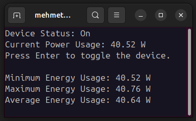

<h1>Smart Plug Energy Monitoring Tool</h1>

This Python script enables real-time monitoring of energy usage through a TP-Link Smart Plug (model P110). Utilizing the <code>PyP100</code> library, it communicates with the smart plug to fetch and display device status and energy consumption metrics. The script showcases the current power usage in watts, alongside the minimum, maximum, and average energy consumption recorded during the session.

<h2>Features</h2>
<ul>
  <li><strong>Device Status Display</strong>: Shows whether the smart plug is currently ON or OFF.</li>
  <li><strong>Real-time Energy Usage</strong>: Monitors and displays the current energy consumption in watts.</li>
  <li><strong>Energy Usage Statistics</strong>: Calculates and displays statistics including the lowest, highest, and average power usage.</li>
</ul>

<h2>How It Works</h2>

The script operates by creating an instance of the <code>PyP110.P110</code> class using the smart plug's IP address, and user credentials (email and password). It then performs a handshake and logs in to the device. Once authenticated, it periodically fetches and updates the device's status and energy usage data, displaying these details in a curses-based terminal interface.

<h2>Setup and Configuration</h2>
<ol>
  <li><strong>Dependencies</strong>: Ensure you have Python 3.x installed along with the <code>PyP100</code> library and <code>curses</code> (pre-installed with Python on Linux/MacOS, for Windows use <code>windows-curses</code>).</li>
  <li><strong>Smart Plug Setup</strong>: Assign a static IP address to your TP-Link Smart Plug through your router settings to ensure consistent connectivity.</li>
  <li><strong>Script Configuration</strong>: Replace <code>"IP"</code>, <code>"email@gmail.com"</code>, and <code>"password"</code> in the script with your smart plug's IP address and your TP-Link account credentials.</li>
</ol>

<h2>Customization</h2>
<ul>
  <li><strong>Refresh Rate</strong>: Modify the sleep duration in the main loop (<code>time.sleep(1)</code>) to adjust the data refresh rate.</li>
  <li><strong>Display Layout</strong>: Adjust the <code>y</code> parameter in <code>update_energy_statistics</code> and coordinate values in <code>stdscr.addstr</code> calls to customize the display layout.</li>
  <li><strong>Additional Metrics</strong>: Extend the script by incorporating more data points available from the <code>PyP100</code> library, such as daily or monthly usage.</li>
</ul>

<h2>Contributions</h2>

Contributions are welcome! Feel free to fork this project and submit pull requests with improvements, bug fixes, or additional features.

<h2>Disclaimer</h2>

This script is for educational and personal use. It is not officially affiliated with or endorsed by TP-Link. Use it at your own risk.

<h2>License</h2>

This project is open-sourced under the MIT license. See the LICENSE file for more details.

